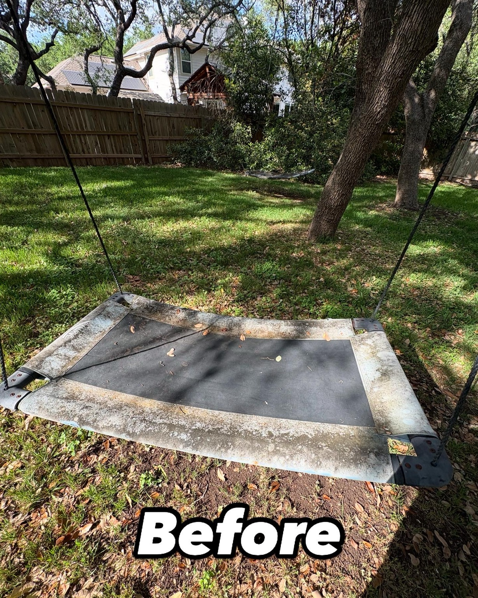
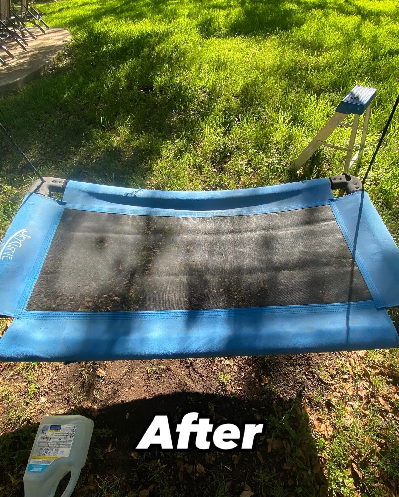
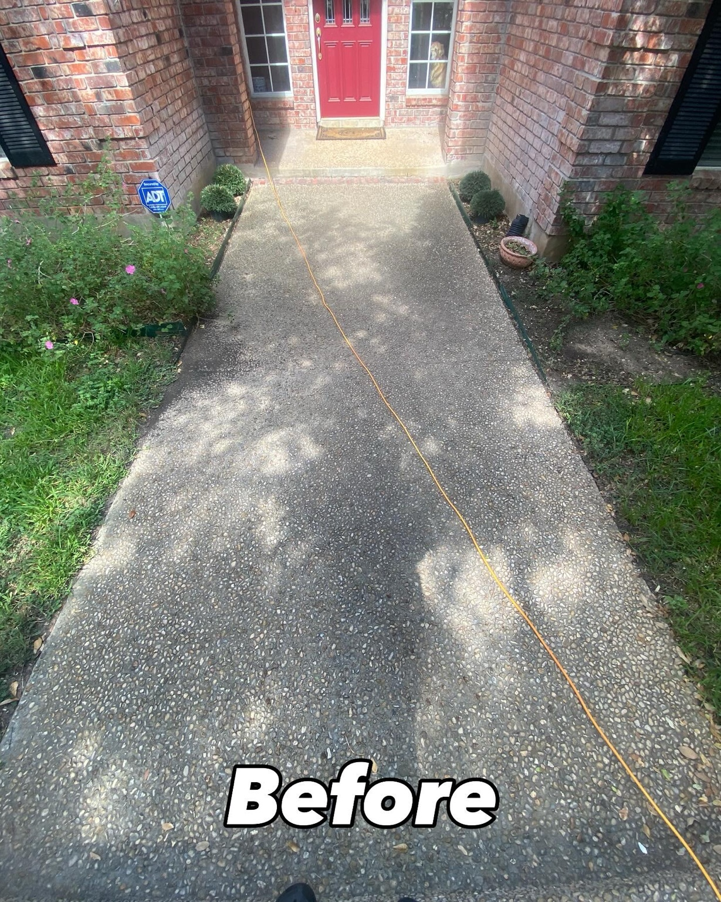
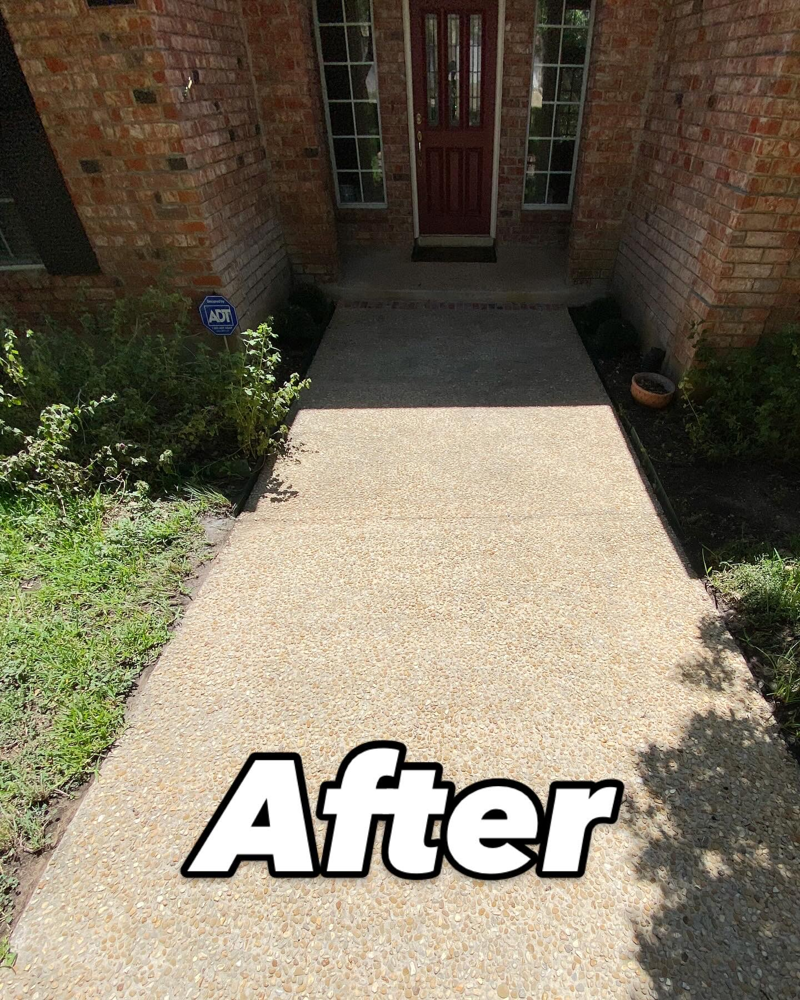

<!DOCTYPE html>
<html lang="en">
<head>
  <meta charset="UTF-8">
  <title>G & F Pressure Washing</title>
  <meta name="viewport" content="width=device-width, initial-scale=1.0">

  
</head>

<body>

<header>
  
  <h1>G & F Pressure Washing</h1>
  
Serving San Antonio, Texas

</header>

<nav>
  <a href="#services">Services</a>
  <a href="#results">Results</a>
  <a href="#about">About</a>
  <a href="#contact">Contact</a>
</nav>

<section class="hero">
  <h1>Make Your Property Look Brand New</h1>
  
Driveways • Homes • Sidewalks • Patios

   
  <a href="#contact" class="btn">Get a Free Quote</a>
</section>

  <h2>Our Services</h2>
  

    

      <h3>Driveway Cleaning</h3>
      
Remove dirt, stains, and buildup.

    

    

      <h3>House Washing</h3>
      
Safely clean your home's exterior.

    

    

      <h3>Patios & Sidewalks</h3>
      
Restore outdoor spaces to like-new condition.

    

  

  <h2>Before & After Results</h2>

  

    
    

      
    

    
  

  

    
    

      
    

    
  

  <h2>About Us</h2>
  

    

      We are Gregory Buchek and Fernando Rodriguez, two hardworking high school students based in San Antonio.
    

    

      We started G & F Pressure Washing to provide high-quality, affordable cleaning services while building real business experience.
    

    

      We take pride in our work, show up on time, and make sure every job is done right.
    

  

  

    <h2>Contact Us</h2>
    
Call or text for a free quote

    <a href="tel:2109311240" class="btn">📞 Call Now</a>
      
    <a href="sms:2109311240" class="btn">💬 Text Us</a>

    
<strong>Phone:</strong> 210-931-1240

  

<footer>
  
© 2026 G & F Pressure Washing

</footer>

</body>
</html>